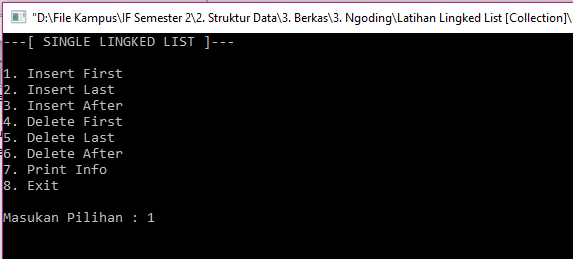
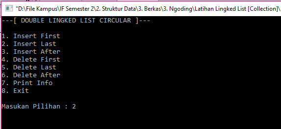
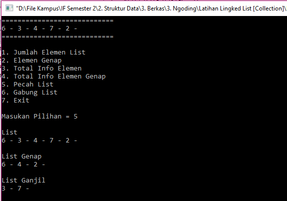

# Kumpulan Aplikasi Penerapan List

:one: Tentang
-------------
* Nama Aplikasi : Kumpulan Aplikasi Penerapan List
* Mata Kuliah : Struktur Data (STD)
* Bahasa Pemrograman : C++
* Software : CodeBlock
* Platform : Desktop
* Kontribusi Saya : Menyeluruh

:two: Deskripsi
---------------
Aplikasi ini digunakan pembelajaran dan penerapan list dalam bahasa pemrograman C++

:three: Fitur
-------------
Aplikasi terdiri dari Single Lingked List, Double Lingked List dan Operasi List (Pecah/Gabung)
- [x] Insert First
- [x] Insert Last
- [x] Insert After
- [x] Delete First
- [x] Delete Last
- [x] Delete After

:four: Screenshoot
------------------

